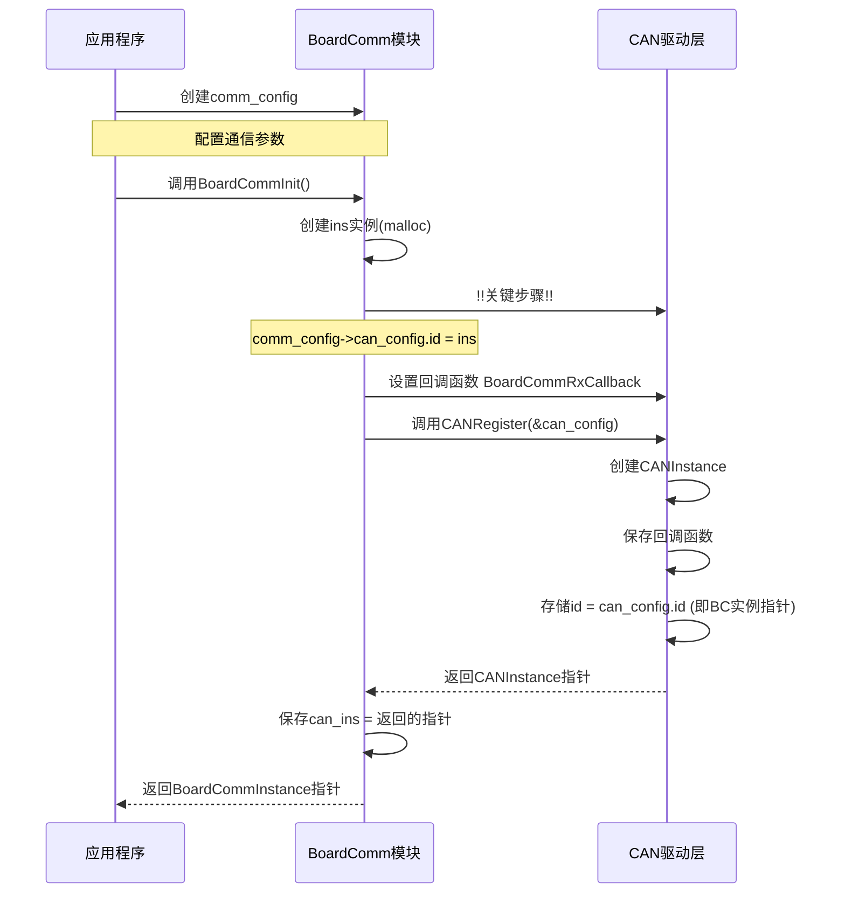

# 双板通信初始化流程

以下是 BoardComm 初始化过程中各模块间的交互流程：

```mermaid
sequenceDiagram
    participant App as 应用程序
    participant BC as BoardComm模块
    participant CAN as CAN驱动层
    
    App->>BC: 创建comm_config
    Note over App, BC: 配置通信参数
    App->>BC: 调用BoardCommInit()
    
    BC->>BC: 创建ins实例(malloc)
    BC->>CAN: !!关键步骤!!
    Note over BC: comm_config->can_config.id = ins;
    BC->>CAN: 设置回调函数 BoardCommRxCallback
    BC->>CAN: 调用CANRegister(&can_config)
    
    CAN->>CAN: 创建CANInstance
    CAN->>CAN: 保存回调函数
    CAN->>CAN: 存储id = can_config.id (即BC实例指针)
    CAN-->>BC: 返回CANInstance指针
    BC->>BC: 保存can_ins = 返回的指针
    BC-->>App: 返回BoardCommInstance指针
```

图注说明：

1. ​**关键绑定步骤**: comm_config->can_config.id = ins
2. 实现了 BoardComm 与 CAN 驱动层的双向绑定
3. 回调函数中通过转换恢复上下文
